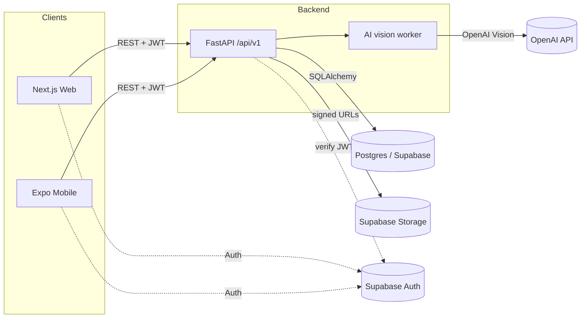

# SaaS Handwerk

## Overview

SaaS Handwerk is a production multi-tenant SaaS for German craftsman businesses (Handwerksbetriebe). It lets a tradesperson capture a customer inquiry, attach site photos, run an AI vision analysis to detect required services and quantities, and turn the result into a priced quote in EUR with German VAT. Companies, customers, inquiries, price lists and quotes are isolated per tenant via a `company_id` column and Postgres Row Level Security.

## Architecture



## Monorepo layout

```
SaaS/
  backend/      FastAPI service, SQLAlchemy, Alembic, pytest
  web/          Next.js app (App Router, TypeScript, Tailwind)
  mobile/       Expo / React Native client
  shared/       TypeScript DTOs and constants shared by web + mobile
  supabase/     SQL migrations, RLS policies, CLI config
  docs/         Architecture, multi-tenancy, API, deployment
  docker-compose.yml
  Makefile
```

## Quickstart

```bash
git clone <repo-url> SaaS
cd SaaS
cp .env.example .env
make up
make migrate
make seed
```

The web app is then on `http://localhost:3000`, the API on `http://localhost:8000`, and the database on `localhost:5432`.

## Environment variables

| Name | Purpose |
| --- | --- |
| `ENV` | `dev` / `staging` / `prod`. |
| `LOG_LEVEL` | Python log level for the backend. |
| `POSTGRES_USER` / `POSTGRES_PASSWORD` / `POSTGRES_DB` | Compose Postgres credentials. |
| `DATABASE_URL` | Async SQLAlchemy URL used by the backend. |
| `TEST_DATABASE_URL` | Optional override used by `pytest`. |
| `SUPABASE_URL` | Supabase project URL. |
| `SUPABASE_ANON_KEY` | Public anon key for client SDKs. |
| `SUPABASE_SERVICE_ROLE_KEY` | Service-role key used by the backend for privileged operations. |
| `SUPABASE_JWT_SECRET` | HS256 secret for verifying Supabase JWTs. |
| `SUPABASE_JWT_JWKS_URL` | Optional JWKS endpoint for RS256 verification. |
| `SUPABASE_STORAGE_BUCKET` | Bucket holding inquiry images. |
| `OPENAI_API_KEY` | OpenAI key for vision analysis. |
| `OPENAI_MODEL` | Default OpenAI model id, e.g. `gpt-4o`. |
| `CORS_ORIGINS` | Comma-separated allowed origins for the API. |
| `DEFAULT_VAT_RATE` | Fallback VAT rate when a company has none set. |
| `DEFAULT_CURRENCY` | Fallback currency code. |
| `JWT_ALGORITHM` | `HS256` or `RS256`. |
| `JWT_AUDIENCE` | Expected JWT audience claim, usually `authenticated`. |
| `NEXT_PUBLIC_SUPABASE_URL` | Supabase URL exposed to the browser. |
| `NEXT_PUBLIC_SUPABASE_ANON_KEY` | Anon key exposed to the browser. |
| `NEXT_PUBLIC_API_URL` | Backend base URL used by the web client. |

## Tech stack

- Backend: Python 3.12, FastAPI, SQLAlchemy 2.x async, Alembic, Pydantic v2, pytest, ruff, uv.
- Web: Next.js (App Router), React, TypeScript strict, Tailwind CSS, pnpm.
- Mobile: Expo, React Native, TypeScript strict.
- Database: Postgres 16 via Supabase (managed) or local Docker for development.
- Auth: Supabase Auth issuing JWTs; backend verifies and resolves `company_id` via memberships.
- Storage: Supabase Storage bucket `inquiry-images`.
- AI: OpenAI vision model (`gpt-4o` by default) for inquiry image analysis.
- Infra: Docker Compose for local, GitHub Actions for CI.

## Branch policy

- `main`: protected, always deployable. Only fast-forward merges from reviewed PRs.
- `dev`: integration branch for the next release.
- Feature work: `feat/<scope>-<short-desc>`.
- Fixes: `fix/<scope>-<short-desc>`.
- Chores / infra: `chore/<scope>-<short-desc>`.
- One PR per branch, squash-merge into `dev`. `dev` is merged into `main` per release with a merge commit tagged `vX.Y.Z`.
