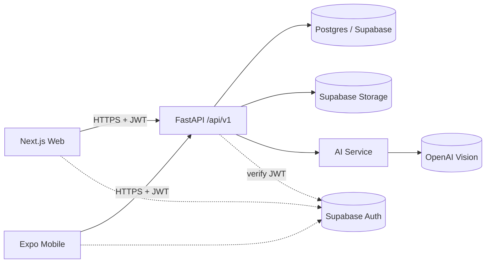
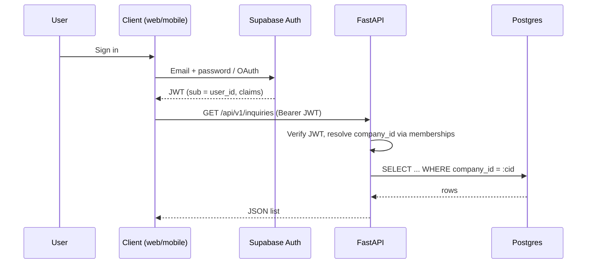
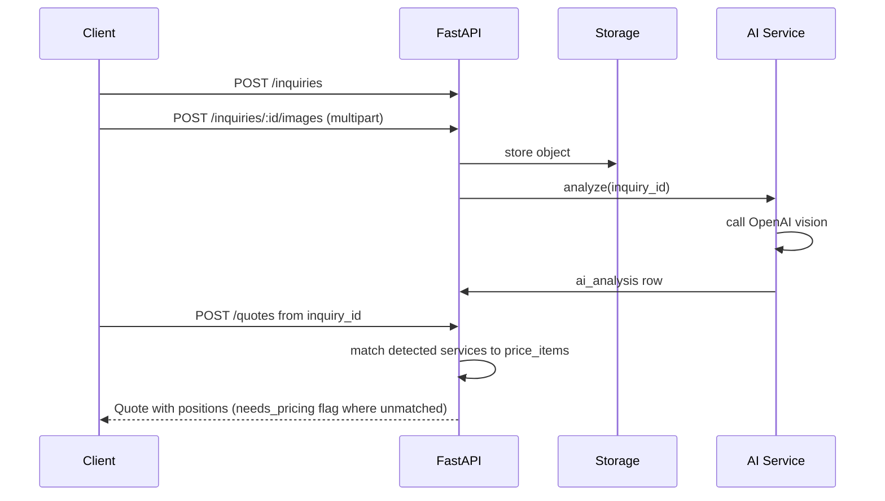

# Architecture

## High-level components

## Request flow

## Inquiry to quote

## Layers (backend)

- `app/api/v1`: FastAPI routers, request/response Pydantic schemas.
- `app/services`: business logic, orchestration, AI orchestration.
- `app/repositories`: SQLAlchemy queries, tenant-scoped.
- `app/models`: ORM models mirroring `supabase/migrations/0001_init.sql`.
- `app/core`: settings, auth, logging, db session.

## Frontend

- `web/` is a Next.js App Router app. Server Components call the API via fetch with the user's JWT forwarded from a Route Handler proxy or via Supabase session cookies.
- `mobile/` is an Expo app sharing DTOs from `shared/types/api.ts`.
