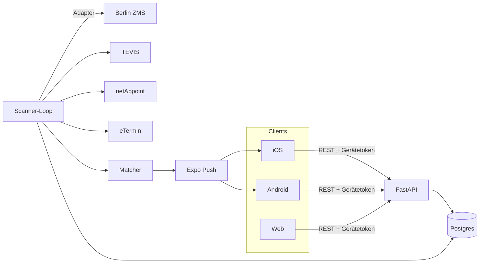

# TerminRadar

Eine App für iOS, Android und Web, die freie Termine bei deutschen Ämtern
findet, per Push meldet und direkt ins offizielle Buchungsportal weiterleitet.

Ein Termin beim Bürgeramt ist selten „nicht verfügbar“ — er ist meistens für ein
paar Minuten verfügbar, nämlich dann, wenn jemand absagt. Wer zufällig gerade
hinschaut, bekommt ihn. Genau dieses Hinschauen übernimmt TerminRadar.

## Was die App macht

1. **Suchauftrag anlegen** — Anliegen (z. B. Personalausweis), Ämter, Wochentage,
   Uhrzeitfenster, gewünschter Vorlauf.
2. **Scannen** — der Server fragt die offiziellen Terminportale regelmäßig ab.
   Abgefragt wird nur, was tatsächlich jemand sucht.
3. **Benachrichtigen** — passt ein neu aufgetauchter Termin, kommt ein Push.
   Mit Entprellung pro Termin, Stundenlimit pro Suchauftrag und Nachtruhe.
4. **Buchen** — ein Tipp führt ins Portal des Amtes, so tief verlinkt, wie das
   jeweilige System es zulässt.

Gebucht wird **immer beim Amt**. Die App bucht nichts eigenständig — warum
nicht, steht in [`docs/legal.md`](./docs/legal.md), und diese Entscheidung prägt
den gesamten Entwurf.

## Aufbau

```
termine/
  backend/   FastAPI: Scanner, Matcher, Push, REST-API
  app/       Expo (React Native): iOS, Android, Web aus einer Codebasis
  docs/      Rechtliches, Adapter-Doku
```



Der Scanner läuft im selben Prozess wie die API (`lifespan` in
`backend/app/main.py`). Bei dieser Größe ist das die richtige Wahl: eine
Deployment-Einheit, kein Broker, und der Abfragetakt liegt bei Minuten. Sobald
mehr als eine API-Replik nötig wird, gehört er in einen eigenen Prozess.

## Schnellstart

Voraussetzungen: Python 3.12, Node 20, npm.

```bash
# Backend
cd termine/backend
uv venv --python 3.12 .venv
uv pip install --python .venv/bin/python -e ".[dev]"
cp .env.example .env

DATABASE_URL="sqlite+aiosqlite:///./dev.db" .venv/bin/alembic upgrade head
DATABASE_URL="sqlite+aiosqlite:///./dev.db" .venv/bin/python -m scripts.seed
DATABASE_URL="sqlite+aiosqlite:///./dev.db" .venv/bin/uvicorn app.main:app --reload
```

```bash
# App
cd termine/app
npm install
npm start          # dann i / a / w für iOS-Simulator, Android, Browser
```

Für Postgres statt SQLite liegt eine Compose-Datei bereit:

```bash
cd termine && docker compose up -d
```

In der Voreinstellung ist `SCANNER_PROVIDERS=demo`: ein synthetischer Anbieter,
der lokal Termine erfindet, die im Minutentakt auftauchen und verschwinden. Der
komplette Ablauf — Suchauftrag, Scan, Treffer, Benachrichtigung — lässt sich
damit durchspielen, ohne ein einziges echtes Amt zu kontaktieren.

Ein Ende-zu-Ende-Durchlauf ohne App:

```bash
cd termine/backend
DATABASE_URL="sqlite+aiosqlite:///./dev.db" PUSH_ENABLED=false SCANNER_ENABLED=false \
  .venv/bin/python -m scripts.smoke
```

## Tests

```bash
cd termine/backend && .venv/bin/pytest && .venv/bin/ruff check .
cd termine/app && npm run typecheck
```

Die Backend-Tests laufen gegen SQLite und gehen nie ins Netz: Adapter werden
gegen abgelegte HTML-Fixtures geprüft, Push-Zustellung über einen gestubbten
Transport.

## Stand der Dinge

**Fertig und geprüft:** Datenmodell, Scanner mit Abgleich und Rückzugslogik,
Matcher, Benachrichtigungen inklusive Entprellung, Ratenlimit und Nachtruhe,
REST-API, Buchungsübergabe, die vollständige App (Suchaufträge, Suche mit
Standort, Meldungen, Einstellungen, Buchungs-Flow), 175 Backend-Tests, sauberer
Typecheck der App.

**Orte:** Das amtliche Gemeindeverzeichnis (GV100AD, Destatis, Stand
30.06.2026) ist importiert — alle 10 943 Gemeinden mit Gemeindeschlüssel,
Kreis, Land und Sitz-PLZ. Eingabe von PLZ oder Ort führt zur Gemeinde und von
dort zur zuständigen Behörde je Anliegen (Gemeinde oder Kreis). Details in
[`docs/orte.md`](./docs/orte.md).

**Katalog: 2 615 Ämter.** Jede Gemeinde und jeder Landkreis wurde geprüft, indem
die eigene Website gelesen und dem Link zum Terminsystem gefolgt wurde.

- **1 199 Ämter in 360 Orten sind überwachbar** — TEVIS-Instanzen, deren
  robots.txt das Abfragen erlaubt und deren Mandanten einzeln erfasst sind.
- **1 392 Portale sind verlinkt** — Terminsysteme ohne Adapter oder mit
  robots.txt-Verbot. Die App führt zur richtigen Behörde und übergibt.
- Zusammen erreichen sie **46 % der Bevölkerung**. Die Tabelle je Bundesland
  steht in [`docs/bundeslaender.md`](./docs/bundeslaender.md).

**TEVIS ist live verifiziert.** Der Adapter wurde gegen zehn Instanzen aller
drei Bauformen geprüft; neun liefern echte Termine. Der erste Live-Lauf zeigte,
dass die ursprüngliche Implementierung nie funktioniert haben konnte — was
daran falsch war, steht in [`docs/providers.md`](./docs/providers.md).

**Noch nicht geprüft:** die Adapter für ZMS (Berlin), netAppoint und eTermin.
Berlin und Bremen untersagen das Abfragen ohnehin und verweisen auf eine API
auf Anfrage.

**Bewusst nicht gebaut:** automatische Buchung, CAPTCHA-Umgehung, Umgehung von
Sperren.

## Weiterlesen

- [`backend/README.md`](./backend/README.md) — Umgebungsvariablen, Aufbau
- [`app/README.md`](./app/README.md) — Bildschirme, Build für iOS/Android
- [`docs/bundeslaender.md`](./docs/bundeslaender.md) — Katalogstand je Bundesland
- [`docs/orte.md`](./docs/orte.md) — PLZ/Ort → Gemeinde → zuständige Behörde
- [`docs/providers.md`](./docs/providers.md) — Adapter, Prüfstand, eigene ergänzen
- [`docs/legal.md`](./docs/legal.md) — rechtliche Leitplanken
